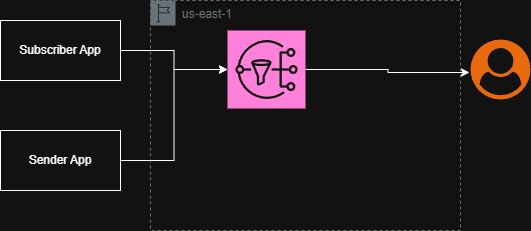

The first version is a Minimum Viable Product (MVP). This should only cover the extreme basics of the Notification System, as such we only want to focus on a product that can generate and send notifications.  We are not concerned with anything beyond that scope for the moment.  This would typically be done as a proof of concept, to simply prove we can do it without spending too much time.  The primary purpose here is to balance budget and level of work.


## Cloud Provider

To begin, we'll start looking at cloud providers to minimize effort.  AWS is a good first choice, being an industry leader and well established in the cloud space.


Looking at AWS's offerings we can see a product called SNS or (Simple Notification Services).  Through AWS SNS we can send notifications through the following methods:


* Amazon SQS
* Lambda
* HTTP(S) endpoints
* Email
* Mobile push notifications
* Mobile text messages (SMS)
* Amazon Data Firehose
* Service providers (For example, Datadog, MongoDB, Splunk)


https://docs.aws.amazon.com/sns/latest/dg/welcome.html


Seeing as our core focus is SMS, Email, and push notifications it appears as though SNS covers all of these topics and then some, this allows us to get a quick start with the ability to expand in the future if we so wish.  SNS also has reasonable pricing amounts as well.  This can be viewed on their [pricing page](https://aws.amazon.com/sns/pricing/), however I will include a table below as well.


### API Requests

* Standard topic requests include publishes, batch publishes, topic owner operations, and subscription owner operations
* First 1 million Amazon SNS requests per month are free, $0.50 per 1 million requests thereafter

***Note:*** Each 64KB chunk of published data is billed as 1 request. For example, a single publish with a 256KB payload is billed as four requests.


### Notification Deliveries

| Endpoint Type | Free Tier | Price |
| --- | --- | --- |
| Mobile Push Notifications | 1 million notifications | $0.50 per million notifications |
| Email/Email-JSON | 1,000 notifications |$2.00 per 100,000 notifications |
| HTTP/s | 100,000 notifications | $0.60 per million notifications |
| Simple Queue Service (SQS) | No charge for deliveries to SQS Queues. Standard SQS pricing applies. Data transfer charges apply between Amazon SNS and Amazon SQS. | --- |
| AWS Lambda |No charge for deliveries to Lambda. Standard Lambda pricing applies. Data transfer charges apply between Amazon SNS and Lambda.|---|
| Amazon Data Firehose | Standard Amazon Data Firehose pricing applies. Data transfer charges apply between SNS and Amazon Data Firehose. | $0.19 per million notifications |


## Infra


I'll start by using [Terraform](https://developer.hashicorp.com/terraform) to manage the infrastructure.  This will allow us to more easily reproduce the exercise as well as quickly destroy all resources that we create when we are done with them since this is just a proof of concept/MVP.


The infrastructure is being stored in the [Infra directory](./Infra).   This includes some basic terraform to simply create a new user with access keys that our application can use as well as create the SNS topic and relevant IAM policies to ensure that we can use SNS.

## Application

A system diagram has been created at [Diagram.png](./diagram.png) that shows how this first pass will operate.  



There will be two small applications written in [GoLang](https://go.dev).  The `Subscriber App` will subscribe users to the SNS topic, the `Sender App` will be used to create and send notifications.  GoLang was chosen due to it's ability to compile into a single, static binary, it's performance, and it's strong support for cloud services.

### Sender App

The [Sender App](./Sender%20App/main.go) is a CLI tool that publishes a single "Hello World" message to the SNS topic. It first reads the `users.csv` [file](./Sender%20App/users.csv) to determine how many users are on the notification list and logs this count. It then makes a single API call to SNS, to send the message to all confirmed subscribers of the topic.

### Subscriber App

The [Subscriber App](./Subscriber%20App/main.go) is a CLI tool used to add new subscribers to the SNS topic. It requires two arguments to run: the protocol (`email` or `sms`) and endpoint (users email or phone number).

  * Usage Example (Email): `go run subscribe.go email user@example.com`
  * Usage Example (SMS): `go run subscribe.go sms +15551234567`

AWS requires the confirmation of people to a SNS topic, so after running AWS sends a confirmation message to the endpoint. The user must click the link in the email or reply to the SMS to confirm their subscription and begin receiving notifications.

### User Data 

A `users.csv` file is a list of all users intended to receive notifications. The file must contain a header row with the following columns:

  * name: The user's name.
  * type: The notification method, either `email` or `sms`.
  * endpoint: The user's email address or their phone number (eg. `+15551234567`).

#### Example `users.csv`:

```csv
name,type,endpoint
Alice,email,alice@example.com
Bob,sms,+15551234567
Charlie,email,charlie@example.com
```

### Application Authentication

Authentication is handled locally through the AWS SDK's default provider. The applications are designed to use credentials set up via the AWS CLI.  In order to set up the credentials the developer must run the `aws configure` command and provide the Access Key ID and the Secret Access Key that are generated by [Terraform](./Infra/iam.tf).