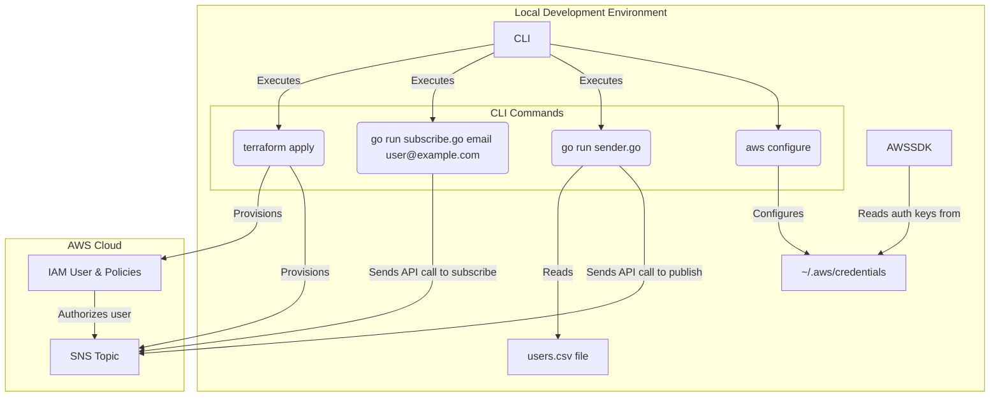

With the successful creation of the [first version](../v1/ReadMe.md) we have proven that we can use SNS to function as the 'backbone' of our notification system and that this is something that's accomplishable.  Now we need to iterate on this idea in order to add more functionality.  As such we have reached stage 2 of the system design.  For this we want to expand the scope to make our system a little more resilient.  As such the scope of V2 will be the following:

 - Centralize Users: Create a database to store user and subscription information
 - Create a Backend API Layer: Rather than relying on CLI tools, we need an API layer to give the system more capabilities and flexibility
 - Web Portal for Self-Service and Administration
   - Public Subscription Page: A simple web page where users can enter their details and subscribe to a topic
   - Unsubscribe Page: A simple web page where users can unsubscribe from topics
   - Admin Page: A password protected page to create and send notifications
 - Handle Subscription Confirmations: Update a user's subscription status when they've confirmed their subscription

### Update diagram

In order to keep this repository from being clogged with images, I decided to rewrite the diagram from V1 in Mermaid.  Since the original was a simple drag and drop from Draw.io, this makes it easier to iterate on until I reach the final product.

