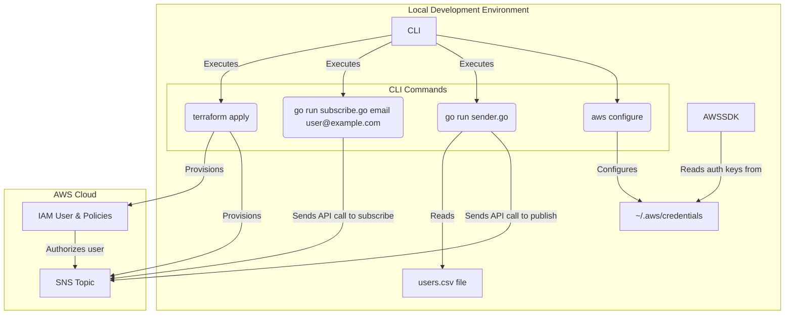
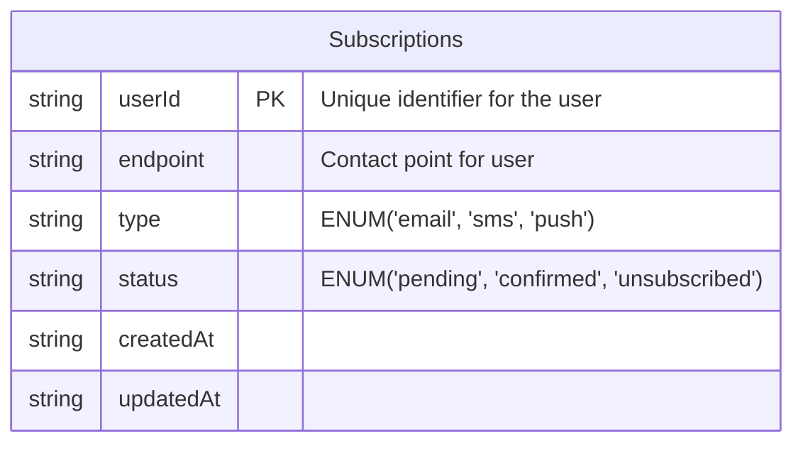
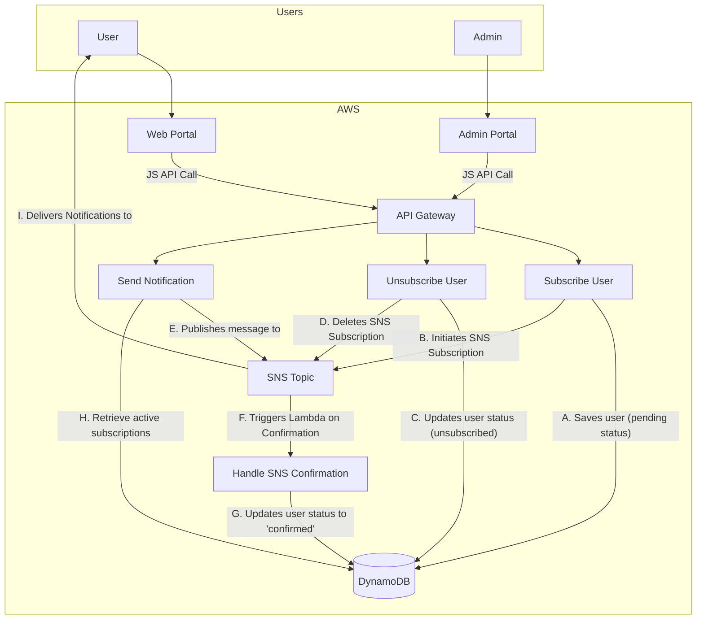

With the successful creation of the [first version](../v1/ReadMe.md) we have proven that we can use SNS to function as the 'backbone' of our notification system and that this is something that's accomplishable.  Now we need to iterate on this idea in order to add more functionality.  As such we have reached stage 2 of the system design.  For this we want to expand the scope to make our system a little more resilient.  As such the scope of V2 will be the following:

 - Centralize Users: Create a database to store user and subscription information
 - Create a Backend API Layer: Rather than relying on CLI tools, we need an API layer to give the system more capabilities and flexibility
 - Web Portal for Self-Service and Administration
   - Public Subscription Page: A simple web page where users can enter their details and subscribe to a topic
   - Unsubscribe Page: A simple web page where users can unsubscribe from topics
   - Admin Page: A password protected page to create and send notifications
 - Handle Subscription Confirmations: Update a user's subscription status when they've confirmed their subscription

### Update diagram

In order to keep this repository from being clogged with images, I decided to rewrite the diagram from V1 in Mermaid.  Since the original was a simple drag and drop from Draw.io, this makes it easier to iterate on until I reach the final product.

## Start on V2

In order to begin on V2 we'll first start by eliminating the go apps and instead leveraging [AWS lambdas](https://aws.amazon.com/lambda/) due to their cost-effectiveness, and scaling capabilities. 

In order to expose them we will utilizes AWS's native API Gateway to create a fully managed, scalable set of RESTful HTTP endpoints. Each endpoint will be mapped directly to a specific Lambda function.

This decouples our frontend (the web portal) from our backend logic. The API Gateway handles all the complexities of request/response cycles, traffic management, and security, allowing our Lambda functions to remain simple and focused on single tasks.

In theory, we could use any available API gateway to manage this for us; however, the use of [AWS API Gateway](https://aws.amazon.com/api-gateway/?nc2=type_a) in this case is a clear choice due to its seamless native integration with AWS Lambda.

### Database

The next step is to establish our database to store user and subscription information centrally. For this, we will use [Amazon DynamoDB](https://aws.amazon.com/dynamodb/?nc2=type_a), a fully managed NoSQL database service.

We will create a single table, named `Subscriptions`, to hold our data. Each item in the table will represent a single user subscription and will include attributes like the user's `endpoint` (email/phone number), their `subscription_status` (e.g., "pending" or "confirmed"), their `medium` (sms,email,push) and the `date` they subscribed. 

### Web Portal

In order to keep costs low and reduce the need for complex infrastructure in order to build the web portal we'll simply create a new [AWS S3 bucket](https://aws.amazon.com/s3/?nc2=type_a) and use it to host a [static site](https://docs.aws.amazon.com/AmazonS3/latest/userguide/WebsiteHosting.html).  We can then interact with our API via JavaScript calls. This approach creates a clean separation between our user interface and our business logic.

### Lambda Functions

As you can see from the provided diagram, our system now consists of 4 lambda functions:

- **SubscribeUser**: Adds a new user to the DynamoDB table with a pending status and then tells SNS to send them a confirmation message.
- **UnsubscribeUser**: Updates a user's status in DynamoDB to unsubscribed and removes their endpoint from the SNS topic to ensure they no longer receive notifications.
- **SendNotification**: Takes a message payload and publishes it to the SNS topic for distribution to all confirmed subscribers.
- **HandleConfirmation**: Triggered directly by an SNS confirmation event. Its only job is to update the user's status from pending to confirmed once they've verified their subscription.

## V2 Wrap up

With the addition of the API gateway, Lambdas, and web portal, the second stage of our system design is now complete. We have successfully evolved the initial proof-of-concept into a more robust, and scalable service.

### V2 Achievements

By moving from a manual, CLI-based system to a fully serverless architecture, we've accomplished the initial goals laid out in the scope of V2.  A few highlights of changes are:

* **Centralized Data**: The `users.csv` file has been replaced with a **DynamoDB** table, providing a single, scalable record for all subscription data.
* **API Layer**: Instead of local Go applications, we now have a scalable API Gateway that exposes our backend logic, making the system accessible to any web client.
* **Web Portal**: The S3-hosted web portal empowers users to subscribe and unsubscribe on their own,  reducing the need for manual intervention.
* **Subscription Status**: The subscription confirmation process is now fully automated, ensuring that a user's status is accurately tracked without any manual steps.

Ultimately, V2 transitions our project from a simple script into an actual serverless application. This not only adds more features but enables us to continue the work on scaling this to a truly production ready application.